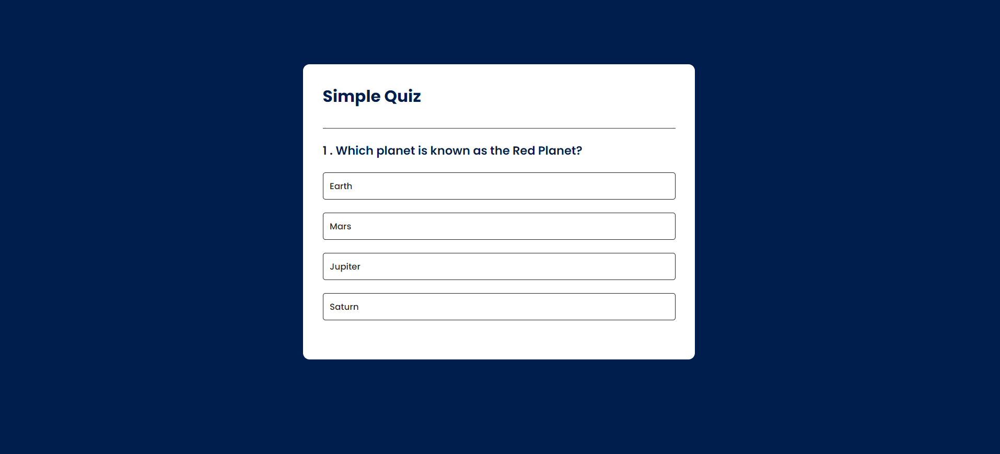
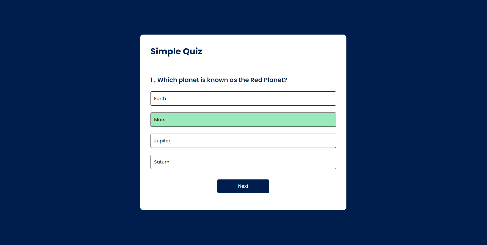
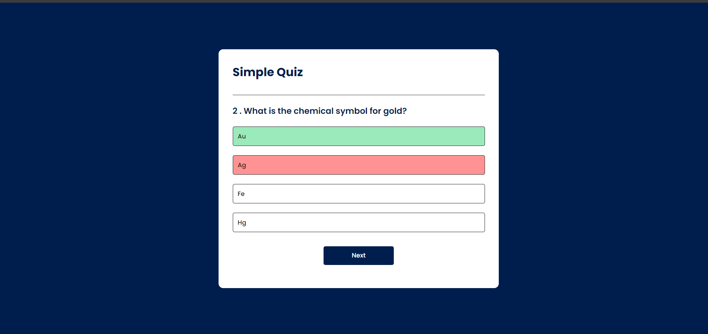

# Quiz App

A simple and interactive quiz application built with HTML, CSS, and JavaScript. This app allows users to take quizzes with multiple-choice questions.

## Features

- User-friendly interface
- Multiple-choice questions
- Score calculation
- Responsive design

## Technologies Used

- HTML
- CSS
- JavaScript

## Screenshots

### Question Example


### Correct Answer


### Wrong Answer


### Final Score


### Installation

1. Clone the repository:
    ```bash
    git clone https://github.com/maheshhattimare/quiz-app.git
    ```
2. Navigate to the project directory:
    ```bash
    cd quiz-app
    ```
3. Open `index.html` in your web browser to start the quiz.

## Usage

1. Open the `index.html` file in your preferred web browser.
2. Answer the multiple-choice questions.
3. Submit your answers to see your score and feedback.
